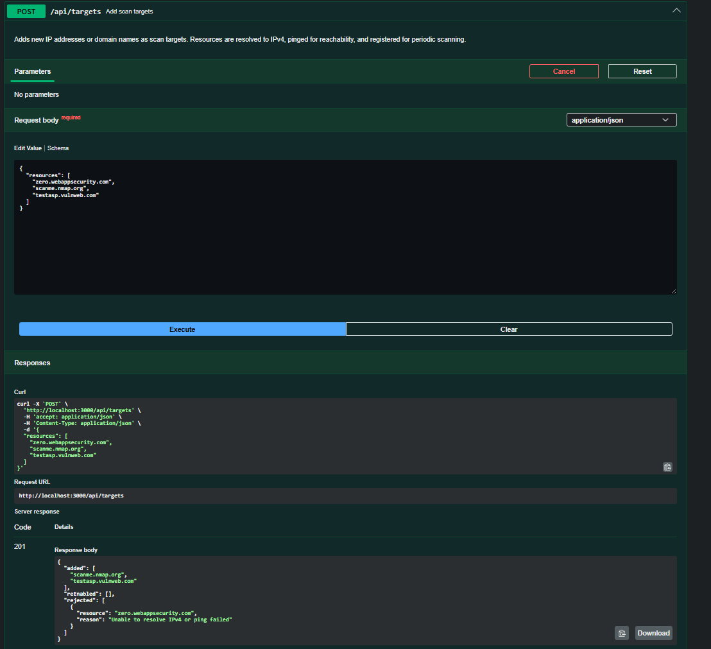
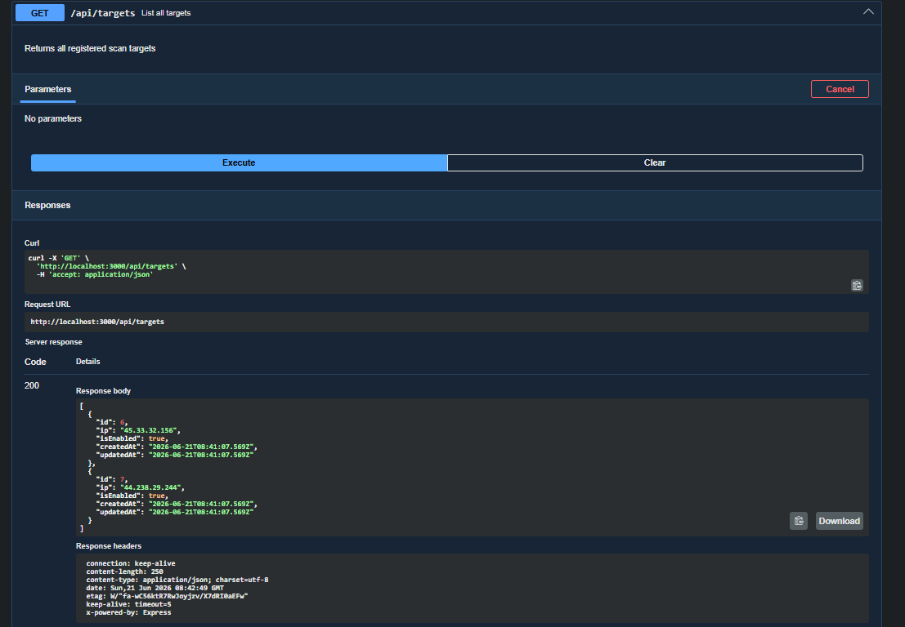
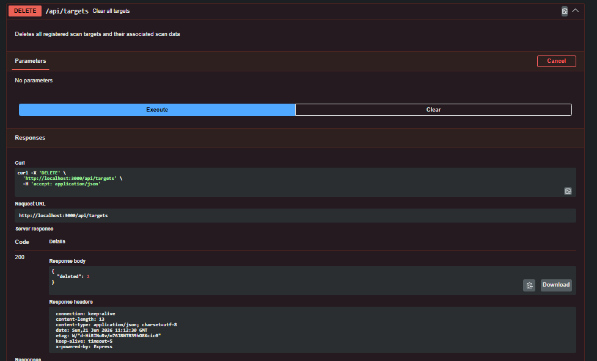
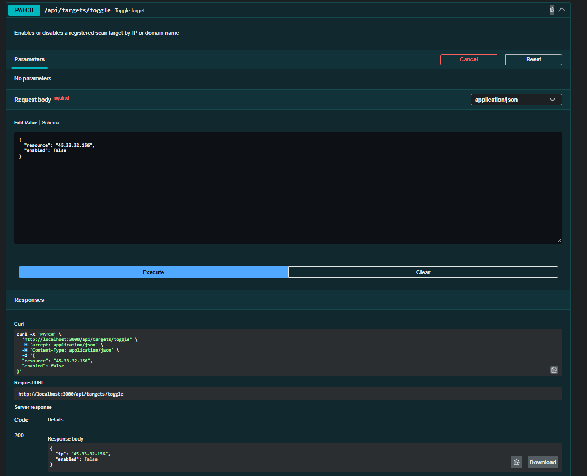
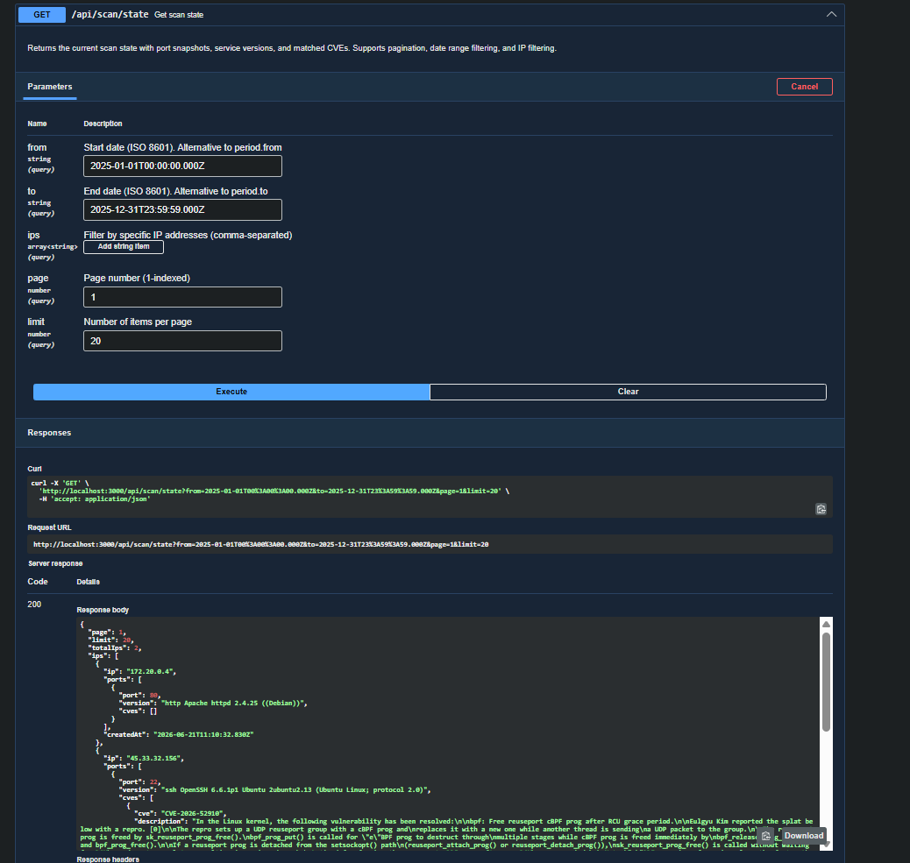
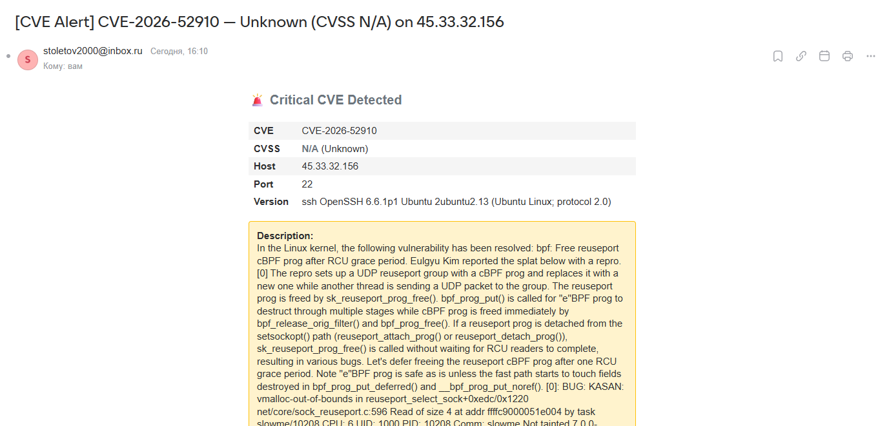
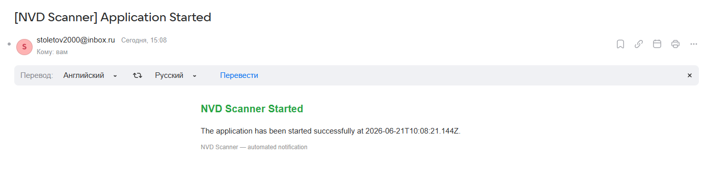
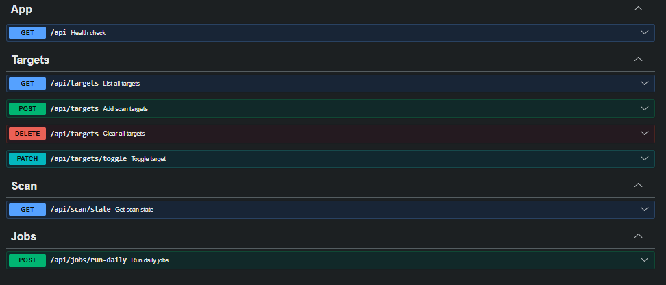

## Overview
Микросервис сканирования открытых портов (`nmap`) и сопоставления с локальной БД CVE (NVD API). Сервис ежедневно инициирует фоновые задачи: сканирование портов для выбранных IP и подтягивание новых записей CVE из внешнего API. Результаты сохраняются в PostgreSQL; история фоновых заданий и снимки портов накапливаются.


## Demonstration

>📁[Открыть папку со всеми скриншотами](./screenshots)

| Экран | Скриншот |
| :--- | :---: |
| **POST** — Добавление целей |  |
| **GET** — Список целей |  |
| **DELETE** — Удаление целей |  |
| **PATCH** — Переключение статуса |  |
| **GET** — Состояние сканирования |  |
| **CVE Alert** — Уведомление об уязвимости |  |
| **Startup** — Уведомление о запуске |  |
| **Swagger** — API документация |  |

## Technology Stack
| Компонeнт           | Технология                              |
| ------------------- | --------------------------------------- |
| Runtime / фреймворк | **Node.js**, **NestJS**, **TypeScript** |
| ORM                 | **TypeORM**                             |
| БД                  | **PostgreSQL**                          |
| Скан                | **nmap** (в контейнере)                 |
| CVE                 | **NVD REST API**                        |
| Контейнер           | **Docker**, образ Node Alpine           |


## Getting Started

### Local Development
1. Установить зависимости:
   ```bash
   npm install
   ```
2. Создать `.env` (можно скопировать из `.env.example`).
3. Запустить приложение:
   ```bash
   npm run start:dev
   ```
4. Приложение доступно на `http://localhost:3000`, префикс API: `/api`.

#### Запуск через docker compose
```bash
docker-compose up --build
```
Сервисы:
- `app` (NestJS, порт `3000`)
- `postgres` (PostgreSQL 16, порт `5432`)

## Swagger
Документация доступна по пути: http://localhost:3000/api/docs#/


## Tests
Запуск тестов:
Unit-тесты
```bash
npm test
```

Интеграционные-тесты
```bash
npm test:integration
```

| Файл | Тестов | Что проверяет |
| :--- | :---: | :--- |
| `targets.service.spec` | 5 | Добавление целей (IP/домен), включение/отключение, ошибки при недоступном адресе |
| `scan.service.spec` | 3 | Парсинг nmap, сохранение снэпшотов, маппинг CVE, вызов уведомлений |
| `cve.service.spec` | 6 | Синхронизация с NVD API, пагинация, retry при ошибках, fallback при 404 |
| `notifications.service.spec` | 8 | Порог CVSS, null-CVSS, отправка письма, ошибки SMTP, startup-уведомление, формат письма |
| `jobs.service.spec` | 1 | Постановка задач на сканирование и CVE-синхронизацию |
| `port-scan.worker.spec` | 10 | Конкурентность, retry, ошибки (таймаут, job not found, target not found, persistent failure) |
| `cve-sync.worker.spec` | 5 | Retry при ошибках NVD, обработка timeout, persistent failure |


